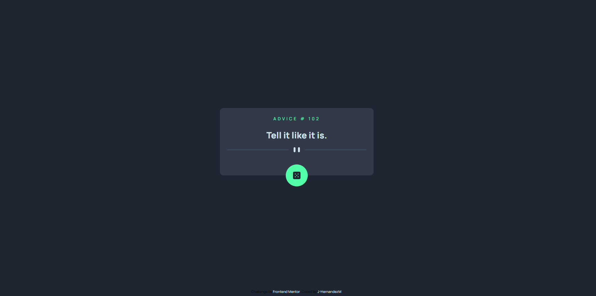

# Frontend Mentor - Advice generator app solution

Esta es mi propuesta de solucion al reto [Advice generator app challenge on Frontend Mentor](https://www.frontendmentor.io/challenges/advice-generator-app-QdUG-13db). 

## Table of contents

- [Descripcion](#descripcion)
  - [El desafio](#el-desafio)
  - [Screenshot](#screenshot)
  - [Links](#links)
- [Mi proceso](#mi-proceso)
  - [Hecho con](#hecho-con)
  - [Lo aprendido](#lo-que-aprendi)
  - [Aprendiendo](#aprendiendo)
- [Autor](#autor)

## Descripcion

Generador de consejos aleatorios haciendo click en un boton, trayendolos desde una [API](https://api.adviceslip.com/#object-slip)

## El desafio

El usuario deberia poder

- Ver el layout optimo dependiendo de su tamano de pantalla.
- Ver la interaccion cuando se coloca el mouse encima de los elementos.
- Generar un nuevo consejo clicando el icono que esta en el contenedor.

## Screenshot

## Links

- Solucion: [GITHUB](https://github.com/J-HernandezM/advice-generator)
- Live site: [PAGES](https://j-hernandezm.github.io/advice-generator)

## Mi proceso

En este ejercicio maneje facilmente el HTML y CSS ya que era un componente relativamente mas sencillo.

Para la logica del JavaScript tuve que recurrir a mis antiguas notas para recordar como hacer las llamadas a API.

La parte que mas me costo fue como lograr hacer un eventListener empleando datos llamados desde una API, asi que tuve que jugar con el orden de llamado de las diferentes funciones hasta lograr dar con el adecuado.

## Hecho con

- Semantic HTML5 markup
- CSS custom properties
- Flexbox
- CSS Grid
- Mobile-first workflow
- simple JavaScript

## Lo que aprendi

Recorde el proceso basico para empezar a usar fetch.

Combinar event listeners con llamadas de API

## En desarrollo

Me gustaria poder minimizar el delay entre una peticion y otra ya que si hago multiples clicks no me permite hacer esa cantidad de cambios en los datos en tiempo real.

## Autor

- Website - [Portfolio en construccion](https://j-hernandezm.github.io)
- Frontend Mentor - [@J-HernandezM](https://www.frontendmentor.io/profile/J-HernandezM)
- Github - [@J-HernandezM](https://github.com/J-HernandezM)
- Twitter - [@__HernandezM](https://www.twitter.com/__HernandezM)

